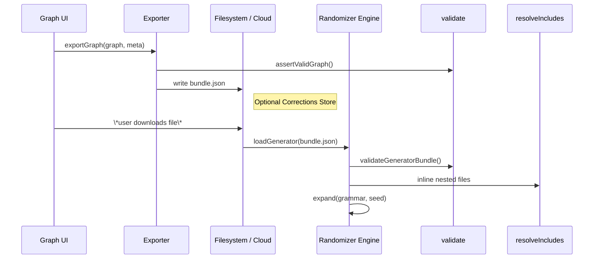

# 0 · Overview
The Randomizer stack now consists of **three cooperatively-versioned layers**:

1. **PromptScape Randomizer Graph** – React-Flow editor (frontend) + Node executor (backend) that authors use to design branching grammars.
2. **Exporter / Importer Bridge** – Converts between in-editor graphs and on-disk **Generator Bundles** (`.json`).
3. **Randomizer Engine Runtime** – JS runtime (browser & Node) that expands grammar rules deterministically.

```
┌──────────────┐   graphToBundle()   ┌──────────────┐   loadGenerator()   ┌────────────────┐
│  Graph UI    │ ──────────────────▶│  Generator    │────────────────────▶│ Randomizer      │
│ (React Flow) │                    │  Bundle JSON │                    │ Engine Runtime │
└──────────────┘   bundleToGraph()  └──────────────┘   exportGraph()      └────────────────┘
```

# 1 · Key Components
| Module                               | Repo Path                          | Responsibility                                   |
| ------------------------------------ | ---------------------------------- | ------------------------------------------------ |
| **Graph Editor**                     | `src/client/**` (PromptScape repo) | Visual editing of nodes + parameters.            |
| **Graph Executor**                   | `src/server/engine.ts`             | Tests graph determinism before export.           |
| **graphToBundle** (Exporter)         | `src/server/exporter.ts`           | Converts live graph → `GeneratorBundle`.         |
| **bundleToGraph** (Importer)         | `src/server/importer.ts`           | Opens legacy bundles back into the editor.       |
| **validateGeneratorBundle**          | `src/utils/validateGeneratorBundle.js` | AJV validation against JSON-Schema.              |
| **Randomizer Engine**                | `src/RandomizerEngine.js`          | Executes bundles + classic generators.           |
| **resolveIncludes**                  | `src/utils/resolveIncludes.js`     | Inlines `$include` & `_meta`+include patterns.   |

# 2 · Import / Export Data Flow


# 3 · Validation & Error Handling
1. **Schema validation** (`validateGeneratorBundle`) blocks loading if the bundle is malformed.
2. **Circular `$include` guard** in `resolveIncludes` aborts if recursion depth > 25 or repeats.
3. **Importer** surfaces a modal listing *all* AJV errors so authors can fix in bulk.

# 4 · Determinism Contract
* Seed flows: **UI seed → Exporter writes `seed` + `metadata.debug.seed` → Engine reads `seed`**.
* Any lockable array rule persists its chosen value in `lockedValues`; Engine uses it to short-circuit RNG.

# 5 · Compatibility Layers
| Source Format              | Import Strategy                |
| ---------------------------| --------------------------------|
| **New Graph Bundle**       | Validate ↦ register ↦ ready.    |
| **Legacy Grammar Folder**  | `legacyShim` converts to bundle before validation. |
| **Zip w/ Assets**          | Unzip; if `bundle.json` found import; asset paths stay relative. |

# 6 · Future Extensions
* **Python Engine Bridge** – gRPC adapter will accept the same `GeneratorBundle` payload for execution.
* **Edge-Case Tuning Module** – Post-process correction layer slots between Exporter and Engine (see design addendum).

---
**Change Log**
2025-07-09 – Added Import/Export flow and component mapping (Cascade).
